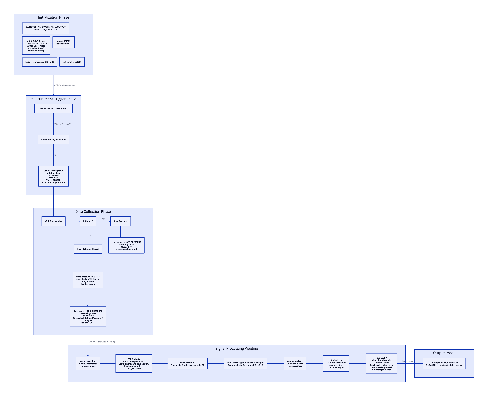

# BT2501 BP Track: Advanced ABPM Blood Pressure Monitor

A professional-grade, ESP32-C3 based Blood Pressure monitoring system featuring real-time oscillometric measurement, autonomous ABPM scheduling, and secure BLE connectivity.

## 🚀 Key Features

*   **Dynamic Oscillometric Measurement**: Real-time signal processing with adaptive pump-up (Dynamic Inflation) to minimize patient discomfort.
*   **Autonomous ABPM Mode**: Support for up to 4 independent measurement windows with custom intervals. Features a 30s audible pre-alarm.
*   **Secure BLE Protocol**: Challenge/Response authentication required for all clinical operations (Start, Sync, History).
*   **Intelligent Power Management**:
    *   **Light Sleep**: Maximizes battery life while maintaining BLE background connections.
    *   **Charging Mode**: Automatic standby detection with 60s OLED protection and charging time estimation.
*   **User Interface**: 128x32 OLED display with screen flip support (P1 button) and Event Marking (P2 button).
*   **Data Integrity**: Stored measurements in Flash with POSIX timestamping and History Dump via BLE.

## 🛠️ Hardware Specifications

| Component | Specification | Connection |
| :--- | :--- | :--- |
| **Microcontroller** | ESP32-C3 (RISC-V) | Native |
| **Pressure Sensor** | WF100D (0-40kPa) | I2C (GPIO 0/1) |
| **Display** | SSD1306 OLED (128x32) | I2C (GPIO 0/1) |
| **I/O Expander** | PCF8574 | I2C (GPIO 0/1) |
| **Buzzer** | Active Piezo | GPIO 19 (LEDC PWM) |
| **Battery Sensing** | 100k/100k Divider | GPIO 2 (ADC) |
| **VBUS Sensing** | USB Detection | GPIO 6 |

### Pinout (ESP32-C3)
*   **SDA/SCL**: GPIO 0 / GPIO 1
*   **Motor/Valve**: GPIO 10 / GPIO 3
*   **Wake Button**: GPIO 18
*   **Buzzer**: GPIO 19

## 📂 Repository Structure

*   `BP_Dev.ino`: Main firmware entry point and system state machine.
*   `ABPM_Manager.cpp`: Logic for autonomous scheduling and low-power wakeups.
*   `BLE_Handler.cpp`: Implementation of the Secure BLE services and characteristics.
*   `Display_Handler.cpp`: UI management for normal, charging, and alarm states.
*   `Storage.cpp`: SPIFFS/Flash management for measurement history.
*   **Docs**:
    *   [User Guide](User_Guide.md): Physical operation and button manual.
    *   [System Flow](BP_Flow_Documentation.md): In-depth firmware logic.
    *   [BLE Protocol](BLE_DATA_FORMAT.md): Data packets and command structure.

## ⚡ Getting Started

1.  **Hardware**: Wire the components according to the [Pin Map](agent.md).
2.  **Arduino IDE**:
    *   Install **ESP32 Board Support (v3.0.0+)**.
    *   Install Libraries: `Adafruit SSD1306`, `Adafruit GFX`.
3.  **Flash**:
    *   Select **ESP32C3 Dev Module**.
    *   Partition Scheme: **Default 4MB with SPIFFS**.
4.  **Usage**: Hold IO18 for 2 seconds to power on.

## ⚖️ License
This project is for educational and R&D purposes. Measurement results should be verified against clinical standards.
